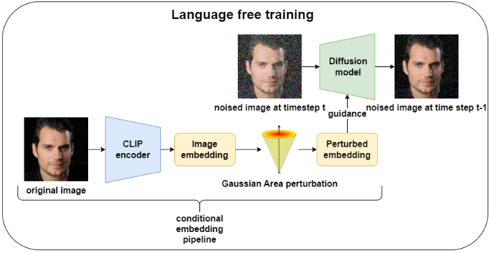
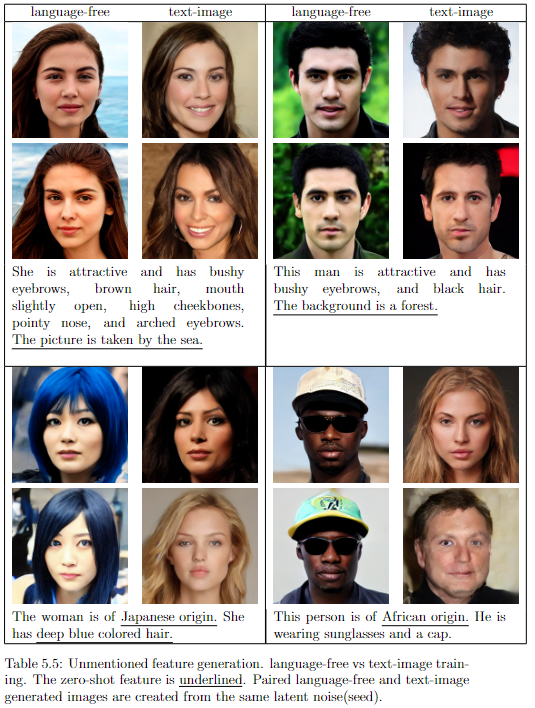

# Fast Language-Free Text-to-Image Generation for Improved Accessibility in Diffusion Models
Official implementation of [coming](blank)
> Abstract: Recent advancements in text-to-image (t2i) generation using diffusion have revolutionized image synthesis. However, diffusion is computationally expensive, requiring multiple forward passes through the neural network to generate images. The trend in both research and industry to scale datasets and architectures further exacerbates this issue, increasing compute requirements and creating economic barriers for many researchers and companies.
Another significant limitation in t2i diffusion is the necessity for text-image paired data during training. Manually labeling images with descriptions is both time-consuming and costly. Moreover, low-quality descriptions can result in the loss of control over certain image features not mentioned in the text.
To address these challenges, this thesis explores the use of masked transformer architectures and language-free training. Masked transformers improve performance and reduce training resources by masking tokens during training. Language-free training leverages cross-modality spaces like CLIP, using only image embeddings during training and eliminating the need for text-image pairs.
Combining these approaches, this work significantly reduces compute requirements and the necessity for text-image pairs. Using the Multi-Modal-CelebA-High-Quality face dataset, new state-of-the-art results are achieved in a language-free setting with substantially lower resource usage compared to previous methods. Additionally, the study uncovers new insights into the advantages of using image embeddings over text embeddings during training.

<div align='center'>

</div>

## Requirements
- In our experiments we use one A100 GPU with a batch size of 128. For a dataset of 70K images. It takes approximate 1 day to converge, dependent on validation configuretions.

## Prepare environment
```bash
python3 -m venv venv
pip install -r requirements.txt
```

## Prepare autoencoder
We use the pre-trained VAE to first encode the dataset into latent space. You can download the pre-trained VAE by using `download_assets.py`. 
```bash
python3 download_assets.py --name vae --dest assets
```

## Prepare dataset
(arguments in file)
```bash
python3 preprocess_scripts/clip_encode_img.py
python3 preprocess_scripts/clip_encode_text.py
python3 preprocess_scripts/create_latentspace_lmdb.py
python3 preprocess_scripts/fid_ref.py
```

## Train
```bash
python3 -u train_latent_t2f.py --config configs/main_config/test/celeb_t2f.yaml --num_process_per_node 1 --enable_eval --master_port [x]
```
## Finetune
```bash
python3 train_latent.py --config configs/main_config/finetune/celeb_t2f_gaus1.2.yaml --ckpt_path [path to checkpoint] --enable_eval --master_port [x]
```

## Test
```bash
python3 -u eval_latent_t2f.py --config configs/main_config/test/celeb_t2f.yaml --ckpt_id_start [start_checkpoint]  --ckpt_id_end [end_checkpoint] --num_process_per_node 1 --master_port 5135 --experiment_dir [experimentation_dir]
```

## Generate Text-to-Image samples
To generate samples(arguments in file):
```bash
python3 -u t2f.py
```

## Checkpoints
Coming.

# Language-free vs Text-Image pair
<div align='center'>

</div>


## Acknowledgements
Thanks to the open source codebases such as [MaskDiT](https://github.com/Anima-Lab/MaskDiT), [DiT](https://github.com/facebookresearch/DiT), [MAE](https://github.com/facebookresearch/mae), [U-ViT](https://github.com/baofff/U-ViT), [ADM](https://github.com/openai/guided-diffusion), and [EDM](https://github.com/NVlabs/edm). Our codebase is built on them.
